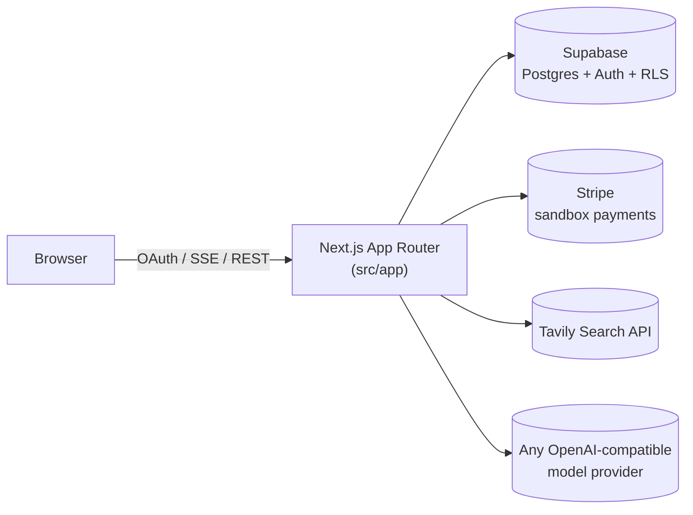

# MicroManus

A miniature Manus + Perplexity: a deep-research AI agent with live web search, a visible
Think → Tool Call → Observe reasoning loop, PDF report generation, Stripe-sandbox
credit billing, and a usage/cost analytics dashboard.

Built with Next.js 16 (App Router), Supabase (auth + Postgres + RLS), Stripe (sandbox
payments), Tavily Search, and the OpenAI SDK (works with any OpenAI-compatible endpoint —
OpenAI, Anthropic/Claude, Moonshot's Kimi, Google, xAI, OpenRouter, Groq, or a fully custom
endpoint).

> **New engineer?** Read this file, then [docs/ARCHITECTURE.md](docs/ARCHITECTURE.md) and
> [docs/SETUP.md](docs/SETUP.md) — you should be running the app locally in under 10 minutes.

## What is MicroManus

MicroManus is a SaaS research assistant. A signed-in, paid user types a research question;
the agent thinks, calls a `web_search` tool (Tavily Search) as many times as it needs, then
calls a `generate_report` tool to produce a structured executive summary (TL;DR, key
findings, recommendations, sources). Every step streams live to the browser over
Server-Sent Events (SSE) as "Agent Thoughts" and a "Research Timeline". Reports can be
exported as PDF or shared via an unguessable public link. Usage is tracked per request
(tokens, cost, cache savings) and surfaced on an Analytics dashboard.

## Features

- Google & GitHub OAuth (via Supabase Auth)
- Coupon or Stripe-sandbox paywall (credits-based access)
- Bring-your-own model API key, encrypted at rest (AES-256-GCM), across 8 provider presets
  or a fully custom OpenAI-compatible endpoint
- Live agent loop: Think → Tool Call (`web_search` / `generate_report`) → Observe, streamed
  over SSE with a visible research timeline and "agent thoughts" panel
- PDF report export and public report sharing (via an unguessable `share_token`, not RLS)
- Usage/cost analytics: tokens, cost estimate, cache savings, streaks, founder insights
- Command palette (`Cmd/Ctrl+K`), onboarding checklist, product tour, founder mode
- Structured logging, in-process metrics, `/api/health` and `/status` deployment checks
- Automated test suite (Vitest) covering credit math, encryption, Stripe packs, health
  checks, and the search tool's retry/failure handling

## Architecture (at a glance)



Full breakdown, including diagrams for auth, the agent loop, credits, Stripe, report
generation, and SSE streaming: [docs/ARCHITECTURE.md](docs/ARCHITECTURE.md).

## Screenshots

No screenshots are committed to this repository. The app requires live Supabase/Stripe/
Tavily/LLM credentials to render meaningful UI state (auth, paywall, live research), which
aren't available in this development environment — rather than ship fabricated or
placeholder images, this README instead documents each screen in
[docs/ARCHITECTURE.md](docs/ARCHITECTURE.md#screens) with the exact component files that
render it, so a new engineer can run the app locally and see the real UI in under 10 minutes.

## API Reference

Every route under `src/app/api/**`, its method, auth requirements, and request/response
shape: [docs/API_REFERENCE.md](docs/API_REFERENCE.md).

## Testing

```bash
npm run test    # vitest run — unit tests for credit math, encryption, Stripe, health checks,
                 # search-tool retry/failure handling, and the coupon redemption route
npm run lint
npm run build
```

See [docs/reports/11_REPORT.md](docs/reports/11_REPORT.md) for full test coverage details
and known gaps.

## Project status

This codebase was built by working sequentially through `docs/prompts/01_AGENT_LOOP.md`
through `14_V2_BACKLOG.md`. Each prompt's report/log lives in `docs/reports/` and
`docs/logs/`; the final ship/no-ship audit is
[docs/reports/10_REPORT.md](docs/reports/10_REPORT.md). The single most important
outstanding item before a production launch is applying the three pending Supabase
migrations (`0002`, `0003`, `0004`) to the live database — see
[docs/DEPLOY_CHECKLIST.md](docs/DEPLOY_CHECKLIST.md).

## 1. Prerequisites

- Node.js 20+
- A [Supabase](https://supabase.com) project (free tier is fine)
- A [Stripe](https://dashboard.stripe.com/register) account in **test mode**
- A [Tavily Search](https://app.tavily.com/home) API key
- At least one model API key: [OpenAI](https://platform.openai.com/api-keys),
  [Anthropic](https://console.anthropic.com/settings/keys), or [Moonshot/Kimi](https://platform.moonshot.ai/)
- A [Vercel](https://vercel.com) account for deployment

## 2. Setup

Full step-by-step Supabase, OAuth, Stripe, and Tavily Search setup lives in
[docs/SETUP.md](docs/SETUP.md). Quick version once `.env.local` is filled in from
`.env.example` (see [docs/ENVIRONMENT_VARIABLES.md](docs/ENVIRONMENT_VARIABLES.md) for what
every variable is and where to get it):

```bash
cp .env.example .env.local   # then fill in every value
npm install
npm run dev
```

Open [http://localhost:3000](http://localhost:3000).

## 3. First-run product tour

1. Sign in with Google or GitHub.
2. You'll land on the **paywall**. Either enter coupon `SID_DRDROID`, or pay $5 via Stripe
   sandbox Checkout (test card `4242 4242 4242 4242`, any future expiry/CVC). Both grant
   **5 credits**.
3. In **Settings**, add a model API key (pick a preset — GPT-4o mini, Claude 3.5 Sonnet, Kimi
   K2, etc. — or enter a fully custom OpenAI-compatible endpoint).
4. Start a new chat and ask: *"Analyze recent California wildfires and generate a report."*
5. Watch the **Research Timeline** and **Agent Thoughts** update live as it searches the web,
   then review the **Executive Summary** and export it as a **PDF**.
6. Open **Analytics** to see total chats, token usage, cost per model/chat, and cache savings.

## 4. Deployment

Full Vercel + Supabase + Stripe + OAuth production checklist:
[docs/DEPLOYMENT.md](docs/DEPLOYMENT.md) and [docs/DEPLOY_CHECKLIST.md](docs/DEPLOY_CHECKLIST.md).

