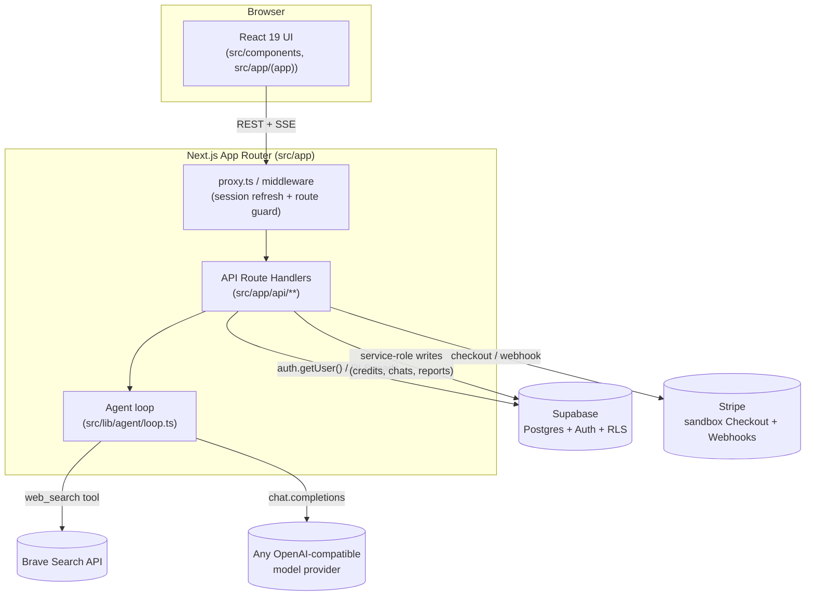
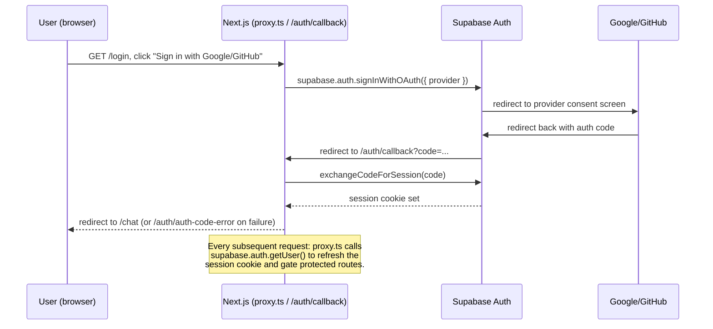
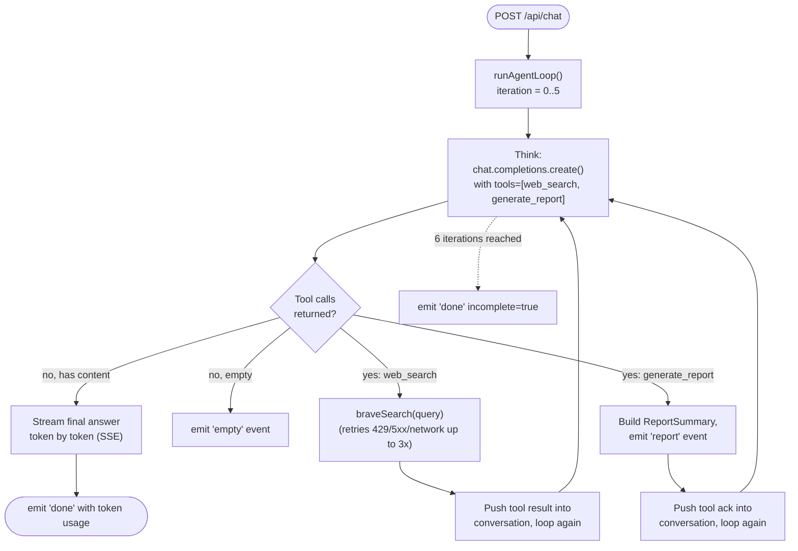
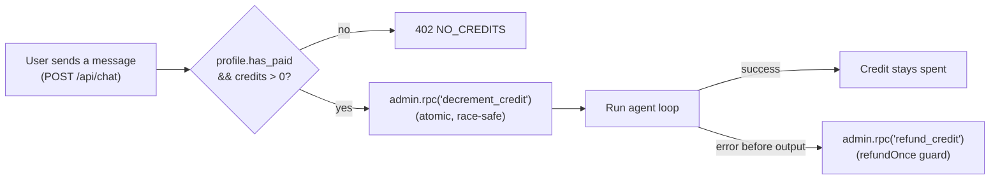
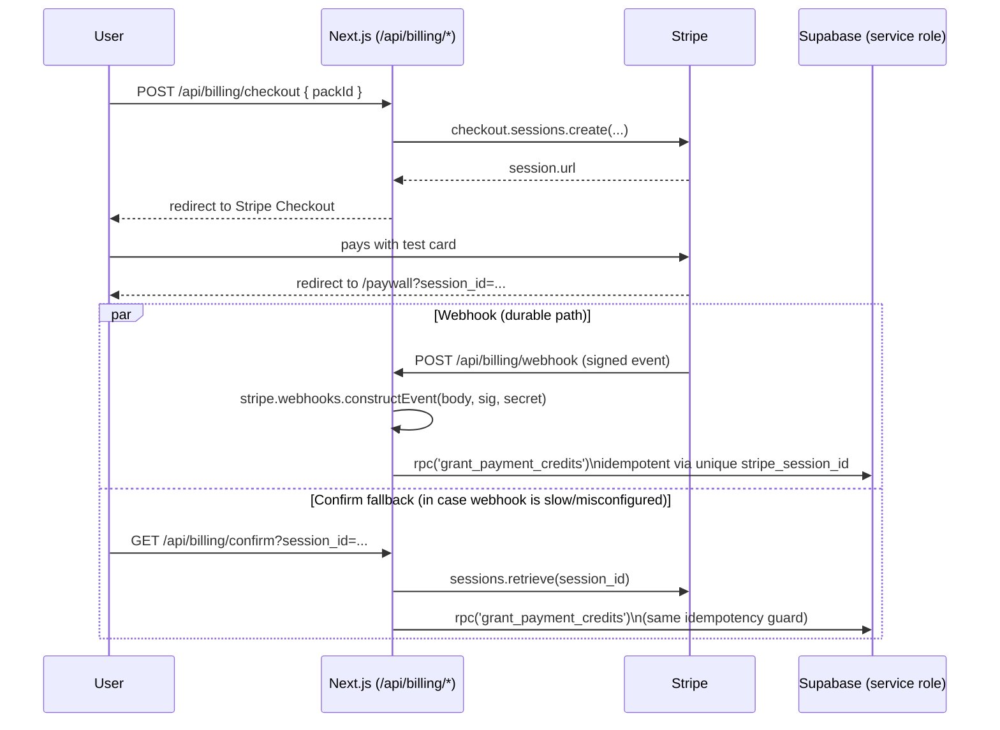
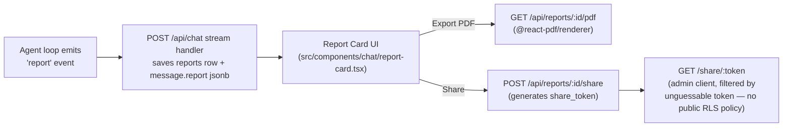
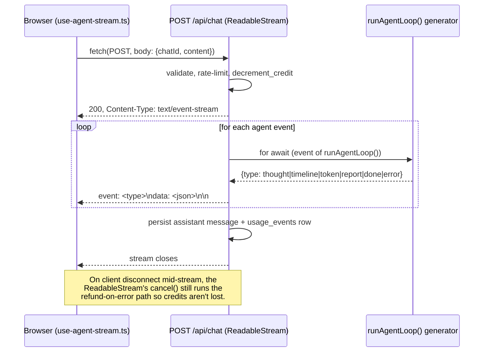

# Architecture

MicroManus is a single Next.js 16 (App Router) application. There is no separate backend —
every "server" concern (auth, database access, LLM calls, Stripe, PDF rendering) is a Next.js
Route Handler under `src/app/api/**`, running in the Node.js runtime.

## System overview

## Key modules

| Concern | Location |
|---|---|
| Route guard / session refresh | [src/proxy.ts](../src/proxy.ts), [src/lib/supabase/middleware.ts](../src/lib/supabase/middleware.ts) |
| Supabase clients | [src/lib/supabase/client.ts](../src/lib/supabase/client.ts) (browser), [server.ts](../src/lib/supabase/server.ts) (RLS-scoped), [admin.ts](../src/lib/supabase/admin.ts) (service-role, bypasses RLS) |
| Agent loop | [src/lib/agent/loop.ts](../src/lib/agent/loop.ts) |
| Agent system prompt & tool schemas | [src/lib/agent/prompt.ts](../src/lib/agent/prompt.ts) |
| Web search tool | [src/lib/agent/brave-search.ts](../src/lib/agent/brave-search.ts) |
| Active model resolution (decrypts key) | [src/lib/agent/config.ts](../src/lib/agent/config.ts) |
| API key encryption at rest | [src/lib/crypto.ts](../src/lib/crypto.ts) |
| Cost/cache estimation | [src/lib/pricing.ts](../src/lib/pricing.ts) |
| Stripe packs/client | [src/lib/stripe.ts](../src/lib/stripe.ts) |
| Rate limiting | [src/lib/rate-limit.ts](../src/lib/rate-limit.ts) |
| Structured logging / metrics / health | [src/lib/logger.ts](../src/lib/logger.ts), [src/lib/metrics.ts](../src/lib/metrics.ts), [src/lib/health.ts](../src/lib/health.ts) |
| PDF rendering | [src/lib/pdf/report.tsx](../src/lib/pdf/report.tsx) |
| Database schema | [supabase/migrations/0001_init.sql](../supabase/migrations/0001_init.sql) (+ `0002`/`0003`/`0004`, **not yet applied to the live DB** — see [DEPLOY_CHECKLIST.md](./DEPLOY_CHECKLIST.md)) |

## Diagram: Authentication flow

Google/GitHub OAuth via Supabase Auth. `proxy.ts` (Next.js middleware) refreshes the session
cookie on every request and redirects unauthenticated users to `/login`.

## Diagram: Agent loop (Think → Tool Call → Observe)

## Diagram: Credit flow

`decrement_credit`/`refund_credit` are SQL functions defined in
`supabase/migrations/0002_security_and_credits.sql` — **not yet applied to the live database**
in this environment (see [DEPLOY_CHECKLIST.md](./DEPLOY_CHECKLIST.md)).

## Diagram: Stripe flow

## Diagram: Report generation & export flow

## Diagram: SSE (Server-Sent Events) flow

## Screens

No screenshots are committed (see README → Screenshots). Each screen maps to real, runnable
component/page files:

| Screen | File(s) |
|---|---|
| Login | [src/app/login/page.tsx](../src/app/login/page.tsx) |
| Paywall (coupon/Stripe) | [src/app/paywall/page.tsx](../src/app/paywall/page.tsx) |
| Chat (agent loop, live timeline/thoughts) | [src/app/(app)/chat/page.tsx](../src/app/(app)/chat/page.tsx), [src/components/chat/chat-window.tsx](../src/components/chat/chat-window.tsx) |
| Report card / PDF export / share | [src/components/chat/report-card.tsx](../src/components/chat/report-card.tsx) |
| Reports list | [src/app/(app)/reports/page.tsx](../src/app/(app)/reports/page.tsx) |
| Settings (model configs) | [src/app/(app)/settings/page.tsx](../src/app/(app)/settings/page.tsx) |
| Analytics | [src/app/(app)/analytics/page.tsx](../src/app/(app)/analytics/page.tsx) |
| Status / deployment health | [src/app/status/page.tsx](../src/app/status/page.tsx) |

## Security notes

- Model API keys are encrypted at rest with AES-256-GCM ([src/lib/crypto.ts](../src/lib/crypto.ts)); the key is derived from `ENCRYPTION_KEY` via SHA-256, never stored in plaintext.
- Stripe webhook signatures are verified with `stripe.webhooks.constructEvent` — requests without a valid signature are rejected before any database write.
- All mutating routes validate input with Zod and use the service-role client only after confirming the request's user via the RLS-scoped `createClient()` — service-role queries are always additionally filtered by `user_id`.
- Report sharing deliberately uses an unguessable `share_token` filtered via the service-role client rather than a public RLS policy, to avoid accidentally exposing all users' reports through an overly broad `OR`-combined policy.
- Per-user sliding-window rate limiting ([src/lib/rate-limit.ts](../src/lib/rate-limit.ts)) fails open on database errors (availability over strictness for a non-security-critical limiter).
