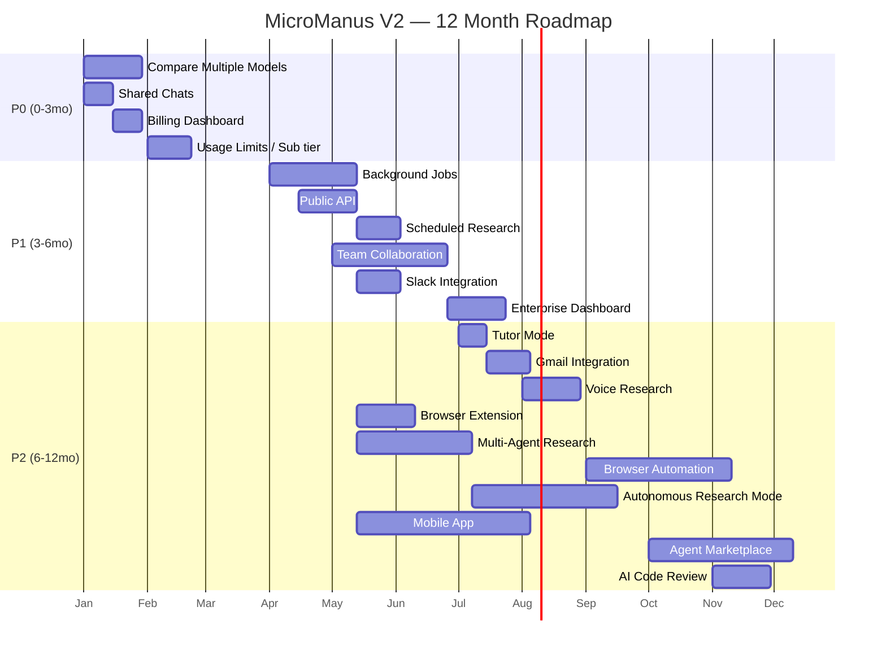

# MicroManus — V2 Roadmap

MicroManus V1 is complete (Prompts 01–13: agent loop, security, credits, Stripe billing,
analytics, model management, UX polish, testing, documentation, performance). This document
lays out a 12-month V2 backlog, grounded in the actual V1 architecture (Next.js App Router,
Supabase/Postgres + RLS, Stripe, per-user BYOK model configs, Brave Search, a single-agent
Think→Tool→Observe loop, credit-based metering).

Every "Technical Dependencies" column below references real, existing V1 modules where a
feature builds on them — this is a build plan, not a wishlist disconnected from the codebase.

## How to read this

- **Complexity**: Low / Medium / High — engineering effort relative to V1's existing patterns.
- **Estimated Time**: solo-engineer-equivalent build time, assuming the codebase's existing
  conventions (RLS-scoped Supabase queries, zod-validated routes, credit-metered agent calls).
- **Priority**: P0 (next, 0–3 months) / P1 (3–6 months) / P2 (6–12 months, exploratory or
  dependent on P0/P1 infrastructure landing first).
- **Revenue Impact**: how the feature is expected to move the business (upsell, retention,
  acquisition, or new pricing tier) — not a guaranteed number, a directional bet.

---

## P0 — Next (0–3 months)

| Feature | Complexity | Est. Time | Revenue Impact | Technical Dependencies |
|---|---|---|---|---|
| **Compare Multiple Models** | Medium | 3–4 weeks | High — direct driver of more credit consumption per query (2–3x tokens billed per comparison); flagship differentiator vs. single-model competitors | Extends `runAgentLoop` (`src/lib/agent/loop.ts`) to fan out one query to N `model_configs` in parallel; extends `estimateCost`/`decrement_credit` to charge per model used; new UI panel (extends `chat-window.tsx`/`message-bubble.tsx`) |
| **Shared Chats** (not just reports) | Low | 1–2 weeks | Medium — acquisition via viral "look what I researched" links, same mechanic that already works for reports | Directly reuses the `share_token` pattern already shipped for reports (`0004_report_sharing.sql`, `src/app/share/[token]/page.tsx`, `api/reports/[id]/share`) — add a `share_token` column + route to `chats` the same way |
| **Billing Dashboard** (self-serve usage + invoice history UI) | Low | 1–2 weeks | Medium — reduces support load, surfaces upsell moments ("you're at 80% of your pack") | `GET /api/billing/history` already returns the data needed; mostly a new `/billing` page consuming an existing endpoint |
| **Usage Limits** (soft caps / plan tiers, e.g. "Pro: 500 credits/mo included") | Medium | 2–3 weeks | High — unlocks a subscription pricing tier layered on top of the existing one-time credit packs | Extends `src/lib/pricing.ts`/`stripe.ts` (`PAYMENT_PACKS`) with a recurring `price_id`, extends `profiles` schema with a plan/renewal column, reuses `decrement_credit`/`refund_credit` RPC pattern from `0002_security_and_credits.sql` |

## P1 — Near-term (3–6 months)

| Feature | Complexity | Est. Time | Revenue Impact | Technical Dependencies |
|---|---|---|---|---|
| **Background Jobs** (durable task queue) | High | 4–6 weeks | Indirect — foundational infrastructure; unlocks Scheduled Research, Multi-Agent Research, and Autonomous Research Mode below | New: a `jobs` table + worker (e.g. Supabase cron + a queue table, or an external worker service) since the current `/api/chat` model is strictly request/response (SSE stream tied to one HTTP connection, `maxDuration=120`) with no persistence of in-flight agent state |
| **Public API** (API-key auth for third-party integrations) | Medium | 3–4 weeks | High — unlocks a developer/enterprise pricing tier, usage-based billing beyond the chat UI | New API-key auth layer alongside existing Supabase-session auth in `src/lib/supabase/server.ts`; reuses `runAgentLoop`/credit-metering as the billing unit |
| **Scheduled Research** (recurring queries, e.g. "run this every Monday") | Medium | 2–3 weeks | Medium — retention driver (habitual use), natural upsell into a subscription tier | Depends on **Background Jobs** above; reuses `runAgentLoop` + `generate_report` tool unchanged |
| **Team Collaboration** (shared workspace, pooled credits, seats) | High | 6–8 weeks | High — the single biggest B2B/enterprise upsell available; converts individual users into team accounts with multi-seat billing | New `teams`/`team_members` tables + RLS policy rewrite (every RLS policy in `0001_init.sql` is currently scoped to `auth.uid()` directly — needs a `team_id` indirection layer); Stripe subscription with per-seat quantity |
| **Slack Integration** | Medium | 2–3 weeks | Medium — acquisition/retention via meeting users where they already work | Depends on **Public API**; new OAuth app + Slack slash-command → `/api/chat`-equivalent call |
| **Enterprise Dashboard** (admin view: team usage, seat management, billing) | Medium | 3–4 weeks | High — required to actually sell the Team Collaboration tier (admins need visibility before they'll pay for seats) | Depends on **Team Collaboration**; reuses the existing `/analytics` aggregation patterns (`src/app/api/analytics/route.ts`) scoped to `team_id` instead of `user_id` |

## P2 — Exploratory / longer-horizon (6–12 months)

| Feature | Complexity | Est. Time | Revenue Impact | Technical Dependencies |
|---|---|---|---|---|
| **Tutor Mode** (guided, educational research flavor) | Low–Medium | 2 weeks | Low–Medium — niche vertical, mostly a prompt/UX variant | New system prompt variant in `src/lib/agent/prompt.ts`; a "mode" selector in chat UI; no new infra |
| **Gmail Integration** (email a report / research from an email thread) | Medium | 3 weeks | Low–Medium — convenience feature, modest retention lift | Google OAuth scopes beyond the existing Supabase Google sign-in (`src/lib/supabase/*`); reuses PDF/report generation (`src/lib/pdf/report.tsx`) |
| **Voice Research** (speech in/out) | Medium | 3–4 weeks | Low–Medium — mobile/accessibility differentiator, not a primary revenue driver on its own | New STT/TTS provider integration (e.g. Whisper-compatible endpoint) alongside the existing OpenAI-compatible `model_configs` pattern; UI work in `chat-window.tsx` |
| **Browser Extension** | Medium | 3–4 weeks | Medium — low-friction acquisition channel ("research this page") | Thin client calling the existing `Public API`; depends on Public API landing first |
| **Multi-Agent Research** (sub-agents collaborating on one query) | High | 6–8 weeks | Medium — premium/flagship feature justifying a higher-tier price point, but expensive per query (multiplies token spend) | Depends on **Background Jobs**; significant extension of `runAgentLoop`'s single Think→Tool→Observe loop into an orchestrator + worker model |
| **Browser Automation** (agent drives a real/headless browser, not just Brave Search) | High | 6–10 weeks | Medium — meaningfully expands what the agent can research (JS-heavy sites, logins), but carries real safety/cost/abuse-prevention overhead | New tool alongside `web_search`/`generate_report` in `runAgentLoop`; needs a sandboxed browser runtime (e.g. headless Chromium in an isolated worker) — the biggest new piece of infrastructure on this whole roadmap |
| **Autonomous Research Mode** (long-running, unattended, multi-step) | High | 8–10 weeks | High (premium tier) but higher risk — must cap runaway credit spend and provider cost | Depends on **Background Jobs** + **Multi-Agent Research**; extends `MAX_ITERATIONS` model in `src/lib/agent/loop.ts` into a job-based, checkpointed loop with hard credit/time caps |
| **Mobile App** | High | 8–12 weeks | Medium — acquisition/retention, but the existing responsive web UI (Prompt 08 UX pass) may cover most mobile use cases more cheaply | Depends on **Public API**; likely React Native or a wrapped PWA rather than a from-scratch rewrite |
| **Agent Marketplace** (users publish/share custom prompt configs) | High | 8–10 weeks | Medium — potential platform take-rate, but requires content moderation and trust/safety work before it's viable | Extends `model_configs`/prompt system (`src/lib/agent/prompt.ts`, `src/lib/agent/config.ts`) into a public, shareable config type; needs moderation tooling that doesn't exist in V1 at all |
| **AI Code Review** (vertical mode for reviewing code diffs) | Medium | 3–4 weeks | Low — niche vertical, competes with dedicated tools (e.g. GitHub Copilot itself); lowest-priority item on this list | New tool + system prompt variant; would need repo/diff ingestion not present in V1 |
| **Enterprise Dashboard**, **Public API**, **Team Collaboration** | *(see P1 — listed there since they gate several P2 items)* | | | |

---

## 12-month phased view

## Revenue opportunities, ranked

1. **Team Collaboration + Enterprise Dashboard** — the largest single opportunity: converts
   individual paid users into multi-seat team accounts, which is a materially larger contract
   value than one-time credit packs.
2. **Usage Limits / subscription tier** — adds recurring revenue on top of V1's one-time
   `PAYMENT_PACKS`, smoothing revenue and improving retention (subscriptions churn less than
   one-time top-ups).
3. **Compare Multiple Models** — increases credits consumed per query today, with no new
   infrastructure required — the fastest near-term revenue lever on this list.
4. **Public API** — opens a developer/programmatic pricing tier and is a prerequisite for
   Slack, Browser Extension, and Mobile App, each of which is itself an acquisition channel.
5. **Shared Chats** — low-cost, high-leverage acquisition (same proven mechanic as report
   sharing), essentially free to build.

## Acceptance Criteria Check

- ✅ Clear roadmap for next 12 months — phased P0/P1/P2 table + Gantt view above.
- ✅ Prioritized backlog — all 20 requested features assigned a priority tier and ordering
  within that tier.
- ✅ Revenue opportunities identified — per-feature "Revenue Impact" column plus a ranked
  summary section.
